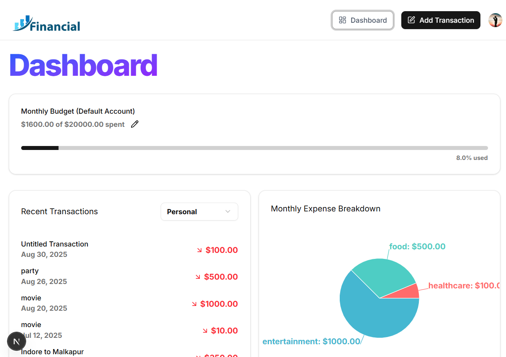

# AI-Powered Personal Finance & Budgeting Platform  


A full-stack personal finance platform built with **React 19, Next.js 15, Tailwind CSS, Supabase, Prisma, Clerk, Arcjet, ShadCN UI, and Gemini API**.  
It helps users **create budgets, track expenses/income, analyze spending habits**, and use **AI-powered receipt scanning** for automatic data entry.

---


## Screenshots  

### Budget Analytics  


---

## Tech Stack  
- Frontend:React 19, Tailwind CSS, ShadCN UI  
- Backend & Database:Supabase, Next.js 15, Prisma, Arcjet  
- Authentication:Clerk  
- AI Integration:Gemini API for receipt scanning  

---

## 🧑‍💻 Getting Started

First, run the development server:

```bash
npm run dev
# or
yarn dev
# or
pnpm dev
# or
bun dev

